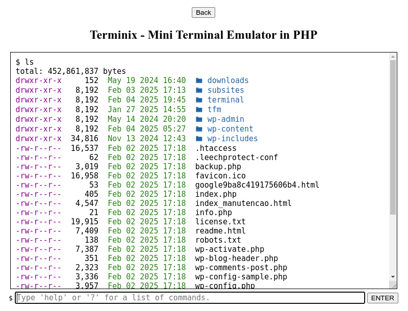

# Terminix - mini PHP terminal emulator

Terminix is ​​a mini PHP terminal emulator. It was created to overcome the lack of a Linux terminal on low-cost servers (usually collective). It provides basic commands for manipulating files and directories, as well as decompression.

## Commands available

Classic ones:
 * cd, clear, cp, ls, mkdir, mv, pwd, rm, rmdir
 
Terminix specific:
 * about - copyright and license information
 * help (or ?) - general help on commands
 * unzap - unarchiver and decompressor (bzip2, gz, rar, tar, zip)