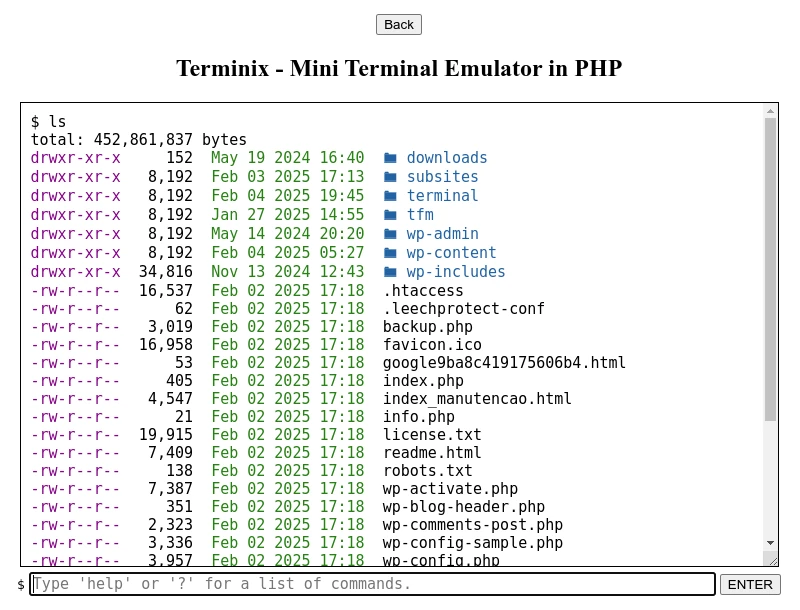
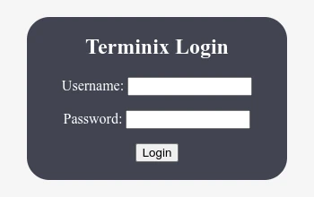

# Terminix - mini PHP terminal emulator

Terminix is ​​a mini PHP terminal emulator. It was created to address the shortcomings of low-cost servers (usually collective), which do not provide access to a terminal emulator, do not have SSH connectivity, and do not enable the use of PHP's `exec()` and `shell_exec` commands. It provides basic commands for file and directory manipulation, as well as decompression.



## Commands available

Classic ones:
 * cd, clear, cp, exit, ls, mkdir, mv, pwd, rm, rmdir
 
Terminix specific:
 * about - copyright and license information
 * help (or ?) - general help on commands
 * unzap - unarchiver and decompressor (bzip2, gzip, rar, tar, zip)
 
## Installation

Download [all the files](https://github.com/nerun/terminix/zipball/main). You won't need `LICENSE.md`, `README.md` or `screenshot.webp`, but the rest certainly will. Especially `.htaccess`, for your security.

Unzip all files to any folder on your server (do not forget `.htaccess`, it's a hidden file!).

Assuming you have installed the files in the `/terminal` folder on your server then, to access the terminal, go to `login.php`:

    https://www.yoursite.com/terminal/login.php

## Defaults

 - username: `admin`
 - passphrase: `123456`
 - algorithm: `PASSWORD_BCRYPT`
 - pepper: `Mrt0lWCxGDuxPLLQ.r1HwO`

## Changing defaults



Create a `shadow.php` file and add this script. Replace `$algorithm`, `$pepper`, `users` and `passwords` with your own, as explained below. Creating the shadow file overwrites the 'admin' account and password '123456' automatically. "Admin" is just a name, there is no distinction of privileges between users. Usernames are case sensitive.

```php
<?php
$algorithm = PASSWORD_BCRYPT;

$pepper = 'Mrt0lWCxGDuxPLLQ.r1HwO';

$valid_users = [
    'user1' => 'password1',
    'user2' => 'password2',
    'etc'   => 'passwordetc',
];
```

A passphrase is user-friendly, easy to remember, but insecure. Whereas a password is more sophisticated and secure, created by deriving the passphrase with the help of an algorithm and a random sequence called a "salt" and a immutable (but hidden) sequence called "pepper", which "seasons" the passphrase before using the algorithm on it.

In order to create a password to your username and insert it in the SHADOW file, run this script on a site like [onlinephp.io][1], changing `$algorithm`, `$pepper` and `$passphrase` of course:

```php
<?php
$algorithm = PASSWORD_BCRYPT;
$pepper = 'Mrt0lWCxGDuxPLLQ.r1HwO';
$passphrase = '123456';

// DO NOT CHANGE BELOW
$password = password_hash($passphrase . $pepper, $algorithm);

echo "COPY PASSWORD HASH:\n";
echo "$password";
```

The generated password will never be the same, even if the same passphrase is used, because the salt changes each time the password is generated. But, to log in, you will use your passphrase, not your password. Since your password is stored in `shadow.php`, every time you use your passphrase, the generated password will be the same, and it will always check. A hacker will have a hard time figuring out your passphrase, even if they have access to your password.

For a list of hash algorithms and their numbers, use this file on your host:

```php
<?php
print_r(password_algos());
```

This will return something like:

```
Array
(
    [0] => 2y
    [1] => argon2i
    [2] => argon2id
)
```

Where `2y` means `brcrypt`. If your host supports `argon2id`, please use it:

* PASSWORD_BCRYPT
* PASSWORD_ARGON2I
* PASSWORD_ARGON2ID

## Change session timeout

Default session timeout is 15 minutes (900 seconds), you may want to change it. Edit both `login.php` and `terminal.php`:

```php
define('TIMEOUT', 900);
```

## Change the "Back" button label and URL

Open `terminal.php` and at the top change this:

```php
define('BUTTON1', 'https://github.com/nerun/terminix');
define('BUTTON1_LABEL', 'Back');
```

[1]:https://onlinephp.io