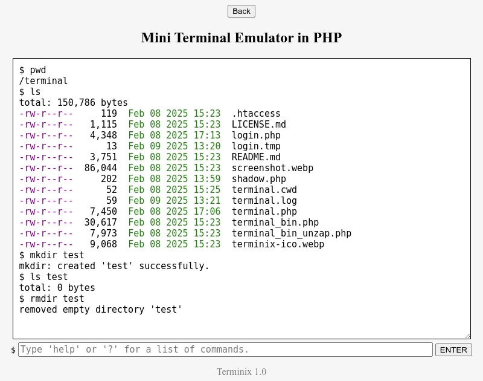

# Terminix - mini PHP terminal emulator

Terminix is ​​a mini PHP terminal emulator. It was created to address the shortcomings of low-cost servers (usually collective), which do not provide access to a terminal emulator, do not have SSH connectivity, and do not enable the use of PHP's `exec()` command. It provides basic commands for file and directory manipulation, as well as decompression.



## Commands available

Classic ones:
 * cd, clear, cp, ls, mkdir, mv, pwd, rm, rmdir
 
Terminix specific:
 * about - copyright and license information
 * help (or ?) - general help on commands
 * unzap - unarchiver and decompressor (bzip2, gz, rar, tar, zip)
 
## Installation

Download [all the files](https://github.com/nerun/terminix/zipball/main). You won't need `README.md` or `screenshot.webp`, but the rest certainly will. Especially `.htaccess`, for your security.

Unzip all files to any folder on your server (do not forget `.htaccess`, it's a hidden file!).

Assuming you have installed the files in the `/terminal` folder on your server then, to access the terminal, go to `login.php`:

    https://www.yoursite.com/terminal/login.php

Defaults:
 - username: `admin`
 - passphrase: `123456`

## Changing users and passwords

Open file `login.php`, and search for `$valid_users`:

```php
$valid_users = [
    'admin' => '$algorithm$salt$hash',
 ];
```

On modern Unix/Linux systems, password hashes follow the format: `$algorithm$salt$hash`. Which means, separated by dollar sign (`$`):
 - `algorithm` = algorithm number as per the `hash_hmac_algos()` array, see below
 - `salt` = salt used
 - `hash` = the hash itself

A passphrase is something user-friendly, easy to remember, but insecure. Whereas a password is something more sophisticated and secure, created by deriving the passphrase with the help of a "hash" algorithm and a random sequence called a "salt", which "seasons" the passphrase before using the algorithm on it.

You need to change the username `admin` and `$algorithm$salt$hash`. To do this, run this script on a site like [onlinephp.io][1], changing `$algo` and `$passphrase` of course:

```php
<?php
$algo = 11; // sha3-256
$passphrase = '123456';
// DO NOT CHANGE BELOW
$algos = hash_hmac_algos();
$salt = base64_encode(random_bytes(33));
$hash = hash_hmac($algos[$algo], $passphrase, $salt);
echo "COPY PASSWORD HASH:\n";
echo "\$$algo\$$salt\$$hash";
```

The generated password will never be the same, even if the same passphrase is used, because the salt changes each time the password is generated. But to log in, you will use your passphrase, not your password. Since your password is stored in `$valid_users`, every time you use your passphrase, the generated password will be the same, and it will always check. A hacker will have a hard time figuring out your passphrase, even if they have access to your password (algorithm, salt, and hash).

For a list of hash algorithms and their numbers, use this on [onlinephp.io][1]:

```php
print_r(hash_hmac_algos());
```

## Change session timeout

Default session timeout is 15 minutes (900 seconds), you must change in both `login.php` and `terminal.php`:

```php
define('TIMEOUT', 900);
```

[1]:https://onlinephp.io